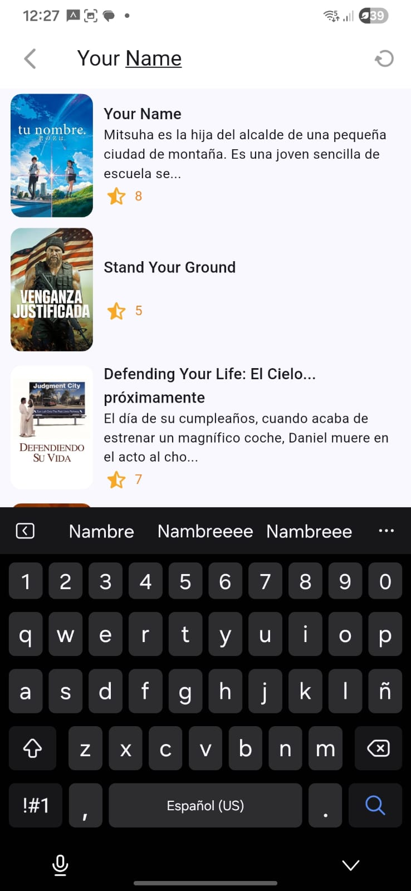
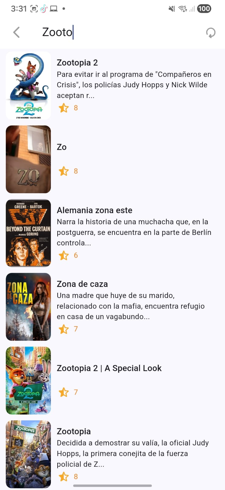

# cinemapedia_220083





---

# Práctica 08  
## Práctica 08: Implementación Completa de Búsquedas y Gestión de Series

El objetivo principal de esta práctica fue incorporar una funcionalidad de búsqueda completa y contextual, permitiendo al usuario buscar tanto películas como series disponibles en la API de TheMovieDB, además de implementar la gestión completa de series de televisión.

### Actividades Realizadas

#### **Fase 1: Búsqueda de Películas**
- **Motor de Búsqueda (Search Delegate)**: Se implementó Search Delegate en Flutter para películas, siguiendo buenas prácticas de experiencia de usuario.
- **Integración con API**: Se configuró el servicio para realizar consultas de búsqueda en tiempo real a la API de TheMovieDB.
- **Debouncing**: Se implementó debouncing de 500ms para optimizar las peticiones a la API.
- **Providers de Búsqueda**: Se creó `search_movies_provider.dart` utilizando Riverpod 3.x para gestionar el estado de búsqueda.
- **Cache de Resultados**: Se implementó cache de resultados y persistencia del query de búsqueda.
- **Experiencia de Usuario**: Se puso especial énfasis en la usabilidad del motor de búsqueda con loading indicators animados.

#### **Fase 2: Gestión de Series**
- **Entidad y Modelos de Series**: Se crearon las estructuras de datos necesarias para representar series de televisión.
- **Datasources de Series**: Se implementaron los endpoints para consumir series desde TheMovieDB:
  - Airing Today (En emisión)
  - Popular
  - Top Rated (Mejor valoradas)
  - Upcoming (Próximamente)
  - Mexican Series (Series mexicanas)
- **Mappers de Series**: Se implementó la lógica para la correcta deserialización de los modelos de series.
- **Providers de Series**: Se crearon 5 providers para gestionar las diferentes categorías de series.
- **Pantalla de Series**: Se desarrolló la vista completa con slideshow y listas horizontales.
- **Detalles de Series**: Se implementó la pantalla de detalles con toda la información de cada serie.

#### **Fase 3: Búsqueda de Series**
- **Search Delegate de Series**: Se implementó un SearchDelegate específico para series con las mismas características de debouncing y optimización.
- **Provider de Búsqueda de Series**: Se creó `search_series_provider.dart` con Riverpod 3.x.
- **Búsqueda Contextual**: Se implementó detección automática del contexto (películas vs series) en el CustomAppbar.
- **Navegación Inteligente**: El ícono de búsqueda detecta automáticamente si el usuario está en la pantalla de películas o series y abre el delegate correspondiente.

#### **Fase 4: Mejoras de UI/UX**
- **Splash Screen**: Se implementó pantalla de bienvenida con animaciones y audio.
- **Sistema de Clasificación**: Se agregó clasificación por edades estadounidense (G, PG, PG-13, R) con colores distintivos.
- **Formateo de Fechas**: Se implementó formateo de fechas en español mexicano (es_MX).
- **Loading Avanzado**: Se crearon loaders con barras de progreso y porcentajes para mejor feedback visual.
- **Navegación por Pestañas**: Se implementó bottom navigation bar para cambiar entre Películas, Series y Favoritos.

#### **Fase 5: Arquitectura y Optimización**
- **Clean Architecture**: Se mantuvo la separación en capas (Domain, Infrastructure, Presentation).
- **Riverpod 3.x**: Se actualizaron todos los providers a la nueva sintaxis de Riverpod 3.x con Notifier.
- **GoRouter**: Se configuraron rutas adicionales para series y splash screen.
- **Código Reutilizable**: Se crearon widgets genéricos para películas y series (horizontal listviews, slideshows).

#### **Testeo**
- Se verificó la funcionalidad completa de búsqueda de películas.
- Se verificó la funcionalidad completa de búsqueda de series.
- Se probó la detección contextual del tipo de búsqueda.
- Se validó la navegación entre pantallas.
- Se comprobó el correcto funcionamiento de todos los providers.
- Se testeó la paginación infinita en todas las categorías.

---

# Estructura Completa del Proyecto Cinemapedia
```text
lib/
├── config/                                    # Configuración general
│   ├── constants/
│   │   └── environment.dart                   # Variables de entorno (API Keys)
│   ├── helpers/
│   │   ├── human_formats.dart                 # Formateo de números
│   │   └── rating_helper.dart                 # Sistema de clasificación por edades
│   ├── router/
│   │   └── app_routes.dart                    # Rutas (Splash, Movies, Series)
│   └── theme/
│       └── app_theme.dart                     # Tema visual
│
├── domain/                                    # Lógica de negocio
│   ├── datasources/
│   │   ├── actors_datasource.dart             # Contrato actores
│   │   ├── movies_datasource.dart             # Contrato películas + searchMovies()
│   │   └── series_datasource.dart             # Contrato series + searchSeries()
│   ├── entities/
│   │   ├── actor.dart                         # Entidad Actor
│   │   ├── movie.dart                         # Entidad Movie
│   │   └── series.dart                        # Entidad Series
│   └── repositories/
│       ├── actors_repository.dart             # Repositorio actores
│       ├── movies_repository.dart             # Repositorio películas + searchMovies()
│       └── series_repository.dart             # Repositorio series + searchSeries()
│
├── infrastructure/                            # Implementaciones
│   ├── datasources/
│   │   ├── actor_moviedb_datasource.dart      # Implementación actores
│   │   ├── moviedb_datasource.dart            # Implementación películas + búsqueda
│   │   └── moviedb_series_datasource.dart     # Implementación series + búsqueda
│   ├── mappers/
│   │   ├── actor_mapper.dart                  # Mapper Actor
│   │   ├── movie_mapper.dart                  # Mapper Movie
│   │   └── series_mapper.dart                 # Mapper Series
│   ├── models/
│   │   └── moviedb/
│   │       ├── credits_response.dart          # Modelo créditos
│   │       ├── movie_details.dart             # Modelo detalles película
│   │       ├── movie_moviedb.dart             # Modelo básico película
│   │       ├── moviedb_response.dart          # Respuesta API películas
│   │       ├── series_details.dart            # Modelo detalles series
│   │       ├── series_moviedb.dart            # Modelo básico series
│   │       └── seriesdb_response.dart         # Respuesta API series
│   └── repositories/
│       ├── actor_repository_impl.dart         # Implementación repo actores
│       ├── movie_repository_impl.dart         # Implementación repo películas
│       └── series_repository_impl.dart        # Implementación repo series
│
├── presentation/                              # UI y Estado
│   ├── delegates/
│   │   ├── search_movie_delegate.dart         # SearchDelegate películas (debouncing)
│   │   └── search_series_delegate.dart        # SearchDelegate series (debouncing)
│   ├── providers/
│   │   ├── actors/
│   │   │   ├── actors_by_movie_provider.dart      # Provider actores por película
│   │   │   └── actors_repository_provider.dart    # Provider repositorio actores
│   │   ├── movies/
│   │   │   ├── initialLoading_provider.dart       # Loading inicial películas
│   │   │   ├── loading_progress_provider.dart     # Progreso carga películas
│   │   │   ├── mexican_movies_sorted_provider.dart # Películas mexicanas ordenadas
│   │   │   ├── movie_info_provider.dart           # Detalles película
│   │   │   ├── movie_slideshow_provider.dart      # Slideshow películas
│   │   │   ├── movies_providers.dart              # 5 categorías películas
│   │   │   ├── movies_repository_provider.dart    # Repositorio películas
│   │   │   └── upcoming_this_month_provider.dart  # Estrenos del mes
│   │   ├── search/
│   │   │   ├── search_movies_provider.dart        # Búsqueda películas (Riverpod 3.x)
│   │   │   └── search_series_provider.dart        # Búsqueda series (Riverpod 3.x)
│   │   ├── series/
│   │   │   ├── initialLoading_series_provider.dart # Loading inicial series
│   │   │   ├── loading_progress_series_provider.dart # Progreso series
│   │   │   ├── series_info_provider.dart          # Detalles series
│   │   │   ├── series_providers.dart              # 5 categorías series
│   │   │   ├── series_providers_export.dart       # Exports series
│   │   │   ├── series_repository_provider.dart    # Repositorio series
│   │   │   └── series_slideshow_provider.dart     # Slideshow series
│   │   └── providers.dart                     # Barrel file todos los providers
│   ├── screens/
│   │   ├── movies/
│   │   │   ├── home_screen.dart               # Pantalla principal películas
│   │   │   ├── movie_detail_screen.dart       # Detalles película completa
│   │   │   └── movie_screen.dart              # Screen simple película
│   │   ├── series/
│   │   │   ├── series_screen.dart             # Pantalla principal series
│   │   │   └── series_detail_screen.dart      # Detalles series completa
│   │   ├── splash/
│   │   │   └── splash_screen.dart             # Splash animado con audio
│   │   └── screens.dart                       # Barrel file screens
│   └── widgets/
│       ├── movies/
│       │   ├── movie_horizontal_listview.dart      # Lista horizontal películas
│       │   ├── movie_horizontal_listview_upcoming.dart # Lista estrenos
│       │   └── movie_slideshow.dart                # Carrusel películas
│       ├── series/
│       │   ├── series_horizontal_listview.dart     # Lista horizontal series
│       │   └── series_slideshow.dart               # Carrusel series
│       ├── shared/
│       │   ├── custom_appbar.dart                  # AppBar con búsqueda contextual
│       │   ├── custom_bottom_navigationbar.dart    # Navegación inferior
│       │   └── fullscreen_loader.dart              # Loader con progreso
│       └── widgets.dart                       # Barrel file widgets
│
└── main.dart                                  # Punto de entrada
```

---

## Tecnologías Utilizadas

### **Core**
- Flutter SDK 3.0+
- Dart 3.0+

### **State Management**
- flutter_riverpod 2.5.1 (Riverpod 3.x)

### **Navegación**
- go_router 14.6.2

### **Networking**
- dio 5.7.0
- flutter_dotenv 5.2.1

### **UI/UX**
- animate_do 3.3.4
- card_swiper 3.0.1
- just_audio 0.9.42

### **Internacionalización**
- intl 0.19.0

---

## Instalación y Ejecución

### **Requisitos Previos**
- Flutter SDK instalado
- Cuenta en TheMovieDB
- Android Studio o VS Code

### **Pasos**

1. Clonar el repositorio
```bash
git clone https://github.com/tuusuario/cinemapedia_220083.git
cd cinemapedia_220083
```

2. Instalar dependencias
```bash
flutter pub get
```

3. Configurar API Key

Crear archivo `.env` en la raíz del proyecto:
```env
THE_MOVIEDB_KEY=tu_api_key_aqui
```

4. Ejecutar la aplicación
```bash
flutter run
```

---

## Autor

**Juan Alberto Vázquez Hernández**  
**Matrícula:** 220083  flu
**Instituto Tecnológico de Puebla**  
**Carrera:** Ingeniería en Sistemas Computacionales  
**Materia:** Desarrollo de Aplicaciones Móviles  

---

**Desarrollado con Flutter**
